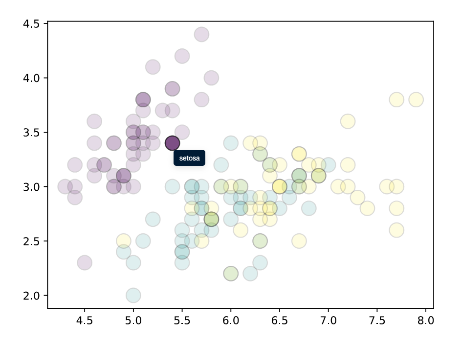

# `plotjs`: Turn static matplotlib charts into interactive web visualizations


`plotjs` is a Python package that transform matplotlib plots into interactive charts with minimum user inputs. It's very easy to use and highly extensible! It lets you:

- control tooltip labels and grouping
- add CSS
- add JavaScript
- and many more

> [!IMPORTANT]
> Consider that the project is still **unstable**.

[Online demo](https://y-sunflower.github.io/plotjs/)

<br><br>

## Installation

From PyPI (recommended):

```
pip install plotjs
```

Latest dev version:

```
pip install git+https://github.com/y-sunflower/plotjs.git
```

<br>

## Quickstart

`plotjs` mainly provides a `PlotJS` class

```python
import matplotlib.pyplot as plt
from plotjs import PlotJS, data

df = data.load_iris()

fig, ax = plt.subplots()
ax.scatter(
    df["sepal_length"],
    df["sepal_width"],
    c=df["species"].astype("category").cat.codes,
    s=180,
    alpha=0.6,
    ec="black",
)

(
    PlotJS(fig)
    .add_tooltip(labels=df["species"])
    .save("iris-scatter.html")
)
```



Open `iris-scatter.html` in your browser to get hover tooltips and default highlight/fade behavior.

<br>

## Why `plotjs`?

`plotjs` keeps your existing matplotlib workflow and adds interactivity on top of the SVG that matplotlib already knows how to generate. Instead of rebuilding the chart in another library, you keep the same `Figure`, export it to HTML, and control the browser-side behavior with CSS and JavaScript.

Learn more in the [Q&A](https://y-sunflower.github.io/plotjs/#qa).

<br>

## Features Overview

- Keep your existing matplotlib figure and export it as a standalone interactive HTML file
- Add hover tooltips from any iterable of labels
- Highlight related elements together with `groups=...`
- Restrict interactivity to specific element types with `on=...`
- Use direct hover or nearest-element hover with `hover_nearest=True`
- Add custom CSS with strings, dictionaries, or files
- Add custom JavaScript with strings or files, and optionally load D3.js
- Work with multiple matplotlib axes in the same figure
- Export either to disk with `save()` or to an HTML string with `as_html()`

<br>

## Documentation

- [Getting started](https://y-sunflower.github.io/plotjs/)
- [PlotJS API reference](https://y-sunflower.github.io/plotjs/reference/plotjs)
- [CSS guide](https://y-sunflower.github.io/plotjs/guides/css/)
- [JavaScript guide](https://y-sunflower.github.io/plotjs/guides/javascript/)
- [Embedding in Quarto, marimo, or websites](https://y-sunflower.github.io/plotjs/guides/embed-graphs/)
- [Troubleshooting](https://y-sunflower.github.io/plotjs/guides/troubleshooting/)
- [Developer architecture overview](https://y-sunflower.github.io/plotjs/developers/overview)

<br>

## Contribution

Looking to contribute? Check out the [contributing guide](https://y-sunflower.github.io/plotjs/developers/contributing/). You can get an overview of how the project works [here](https://y-sunflower.github.io/plotjs/developers/overview/), and in the [AGENTS.md file](https://github.com/y-sunflower/plotjs/blob/main/AGENTS.md).
