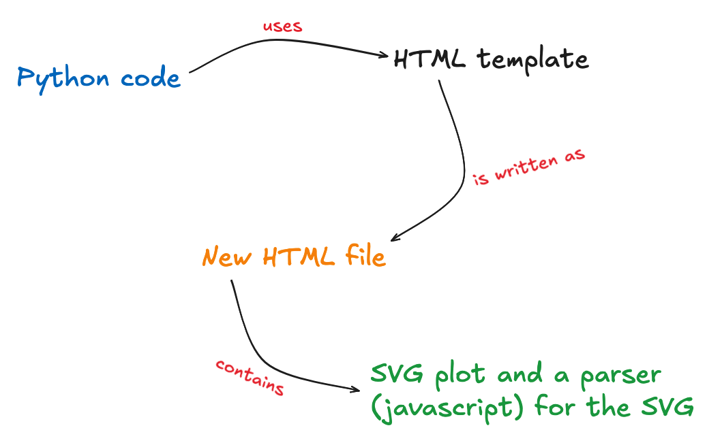

The core idea behind `plotjs` is that since you can natively save a matplotlib plot as [SVG](https://developer.mozilla.org/en-US/docs/Web/SVG), it's possible to manipulate that SVG from the browser.

In practice, the saved HTML file from `plotjs` is just:

- the SVG output from matplotlib
- some CSS styling (default and from user)
- a parser for the SVG (in javascript) and javascript from user

## Core issues

There are 2 things important things to solve at this point:

- communicate info from Python to JavaScript
- parse the SVG with JavaScript

The first point is important because the SVG file is not enough for us to parse it correctly. We need some info from the original matplotlib `Figure`. This is mainly solved using [`jinja2`](https://jinja.palletsprojects.com/en/stable/), often used in web development. This allows us to pass variables from Python to an HTML template (e.g., simple HTML file with placeholders that we'll fill). The core things we want to pass are:

- the SVG of the plot
- the JavaScript parser (kept in its own js file)
- additional CSS/JS from the user
- a dictionnary with custom info (named `plot_data_json` in the codebase)

`plot_data_json` is passed directly to JavaScript and is then parsed with `JSON.parse()`. This works because Python dictionnaries can be (assuming a few rules that we respect here) valid JSON and be considered as such.

Then we "just" have to parse the SVG and apply the effects the user want: hover, onclick effects, etc. You can learn more about how the SVG is parsed [here](./parsing-matplotlib-svg.md).
