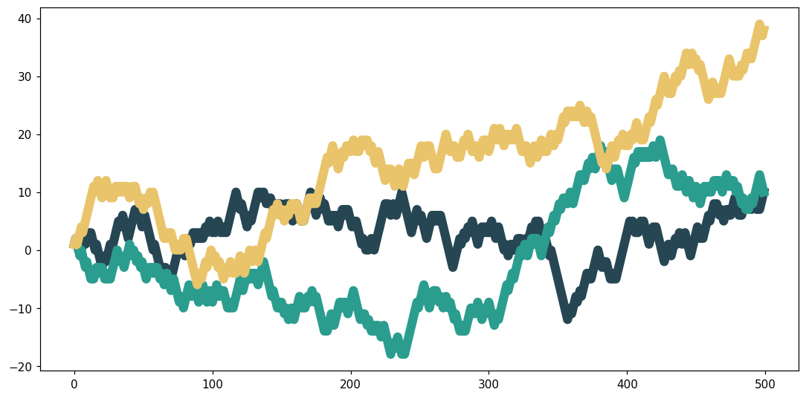
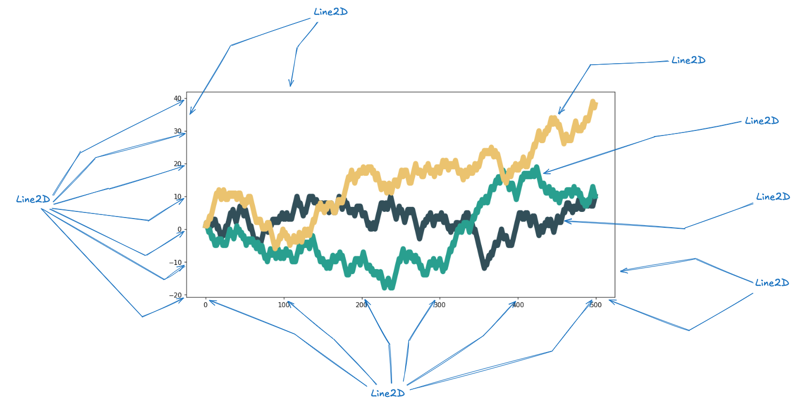

Transforming a static plot into something interactive can't be done (unfortunately) just by saying "make this interactive."

But that doesn't mean we have to do mystic things to make it work, because **yes**, that's perfectly possible without weird hacking stuff.

## Overview

There are two ways to tackle this problem:

- Take a matplotlib Figure (an instance containing all plot elements) and convert it to a more common format such as JSON. We call this **serialization**. Then, with this JSON file, we recreate the figure with an interactive tool such as D3.js (that's what [mpld3](https://github.com/mpld3/mpld3) does, by the way!).
- Use the native matplotlib figure output format (especially SVG) and parse this instead (that's what `plotjs` does).

The second option is **much simpler** (well, it depends), because we don't have to:

- translate the figure to JSON (which can be painfully complex if you want to handle all edge cases and make it robust),
- recreate the chart (browsers can display SVG perfectly).

But it means we don't have full control over how the plot is structured (from the browser's point of view). We need to find a way to parse this SVG.

## Parsing SVG

For the moment, we just take the user's matplotlib figure and save it as SVG. This is just:

```python
plt.savefig("plot.svg")
```

Now, let's say the figure contains a scatter plot and we want to add a tooltip: when someone hovers their mouse over a point, it displays a label.

The **core problem to solve** is: "how do I know what elements from the SVG are points?"

If we're able to find a solution to this, then we're able to do pretty much **anything we want**.

The thing is, there's nothing in the SVG output file that tells us "this element is a point from the scatter plot." **Even worse**, we don't even know if it's a scatter plot or something completely unrelated, like a choropleth map.

For example, here is a polygon of a choropleth map:

```svg
<path d="M -5.94098 449.279178
L -4.961244 447.127034
L -4.623284 444.786333
L -3.951831 442.584471
L -5.459995 439.551953
L -5.763812 436.050818
L -3.764043 431.650797
L -2.459548 432.213824
L 0.368893 433.425033
L 4.436122 437.74466
L 5.072043 439.840475
L 2.799722 444.523728
L 1.620088 448.292228
L 0.147953 450.236113
L -1.691322 450.601856
L -2.215184 449.161231
L -3.074426 448.947286
L -4.263489 450.334887
z
" clip-path="url(#pf43ab1627f)" style="fill: #424186"/>
```

Here is a point from a scatter plot:

```svg
<use
   xlink:href="#m81e2893e84"
   x="145.978182"
   y="144.288"
   style="fill: #1f77b4;
   stroke: #1f77b4"
/>
```

Here is a line from a line chart:

```svg
<g id="line2d_19">
   <path d="M 73.832727 295.488
L 154.996364 235.008
L 236.16 174.528
L 317.323636 114.048
L 398.487273 53.568
"
   clip-path="url(#pd511a61f39)"
   style="fill: none;
   stroke: #1f77b4;
   stroke-width: 1.5;
   stroke-linecap: square" />
</g>
```

If you pay close attention, you'll see potential patterns in the structure of certain elements.

That's exactly what we'll use to determine what kind of plot elements we have.

> Note: determining the kind of plot elements could have been done (partially) from the Python side, but this felt easier to me to do from the JavaScript side.

The next step is to understand matplotlib's underlying objects (called [artists](https://matplotlib.org/stable/users/explain/artists/artist_intro.html){target="\_blank"}) and how that translates to SVG.

## TL;DR: Artists in matplotlib

In matplotlib, artists are all the visual elements you see on a plot. There is the `Artist` base class, and all other artists inherit from this class.

For example:

- the `scatter()` function returns a `PathCollection` object, a subclass of `Artist`,
- the `plot()` function returns a `Line2D` object, a subclass of `Artist`,
- and so on.

## Selecting artists from SVG

In the SVG output of `savefig("plot.svg")`, we can find some info about what object was used.

For example, all `PathCollection` objects look like `<g id="PathCollection_1">`, `<g id="PathCollection_2">`. And since `PathCollection` is just one or multiple points, we can easily know how many scatter plots there are.

For lines, they are represented by `Line2D`. In the SVG, they look like `<g id="line2d_1">`, `<g id="line2d_2">`, etc. With this, we can easily detect that there are lines in the chart.

But there's a major issue here: not all `PathCollection` elements are relevant, same for `Line2D`, and so on.

By "relevant," I mean those we want to add interactivity to. For example, what elements here are considered to be a `Line2D`?



At first, I thought there were three: one for each main line. But in practice, it's much more:



What that means is that we can't just select all `Line2D` elements and give them a hover effect, for instance. We need to find a way to discriminate relevant lines (the three big ones) from the other ones.

## Filtering artists from SVG

This section might not be up to date with the latest version, but it'll give you an idea of how `plotjs` detects what is a "core" plot element and what is not.

It mostly consists of handling edge cases here, and is very different depending on the plot element (`Line2D`, `PathCollection`, etc.).

For example, in order to select only "core" `Line2D` elements (the three colored ones in the previous image), we do:

```javascript
const lines = svg.selectAll('g[id^="line2d"] path').filter(function () {
  const clip = d3.select(this).attr("clip-path");

  return (
    // keep only <path> with clip-path attribute
    clip &&
    // that starts with "url("
    clip.startsWith("url(") &&
    // and are not child of a #matplotlib.axis
    !this.closest('g[id^="matplotlib.axis"]')
  );
});
```

The idea is basically:

- select all `Line2D` elements with the first line,
- filter to remove non-wanted `Line2D` elements.

This gives us a `lines` variable that only contains the lines of interest!

The logic is the same for other plot elements: bars, points, polygons, etc.

<br>

You can find the **reference page** of the parser [here](./svg-parser-reference.md)
