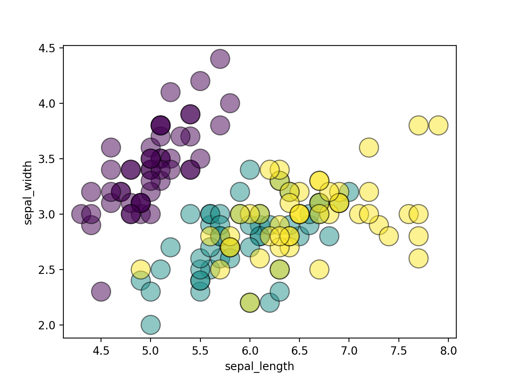

# d3scribe

What if matplotlib was interactive (with cool hover animated effects?).

But matplotlib charts are static:

```python
import matplotlib.pyplot as plt
import pandas as pd
from d3scribe import interactivePlot

path = "https://github.com/y-sunflower/fleur/blob/main/fleur/data/iris.csv?raw=true"
df = pd.read_csv(path)

fig, ax = plt.subplots()
ax.scatter(
    df["sepal_length"],
    df["sepal_width"],
    c=df["species"].astype("category").cat.codes,
    s=300,
    alpha=0.5,
    ec="black",
)
ax.set_xlabel("sepal_length")
ax.set_ylabel("sepal_width")
```



What if we make it interactive? In 1 line with `d3scribe`, it becomes:

```python
interactivePlot(tooltip=df["species"].to_list())
```

<iframe width="800" height="600" src="quickstart.html" style="border:none;"></iframe>

> Try to hover the points!
