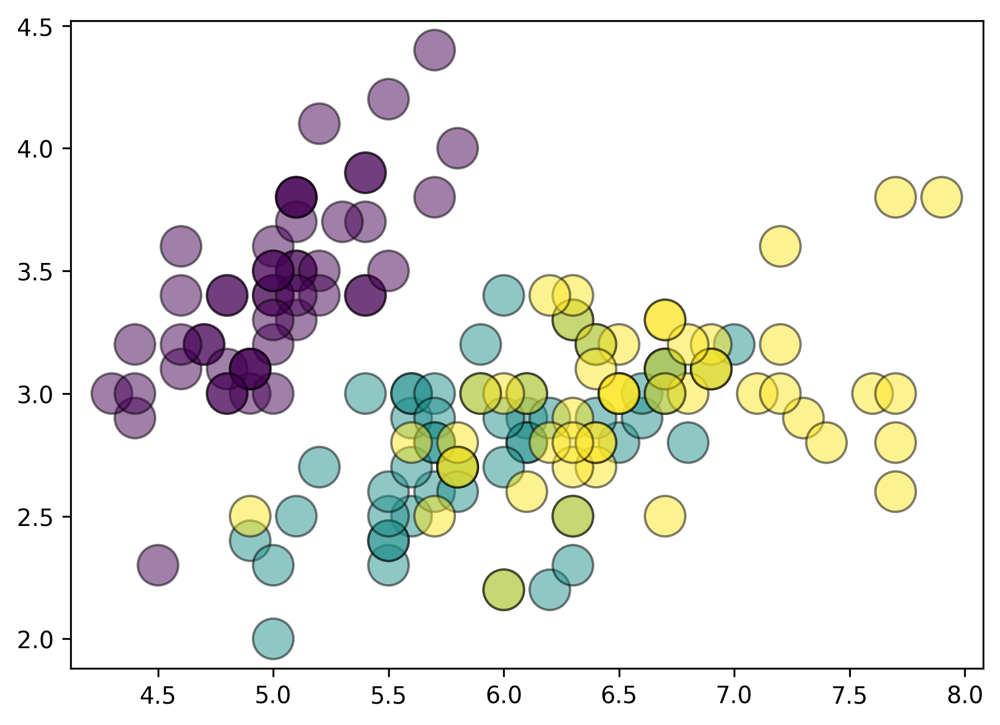

# Turn static matplotlib charts into interactive web visualizations


`plotjs` is a Python package that transform matplotlib plots into
interactive charts with minimum user inputs. You can:

- control tooltip labels and grouping
- add CSS
- add JavaScript
- and many more

???+ warning

    `plotjs` is in very early stage: expect regular breaking changes.

## Get started

Matplotlib is **great**[^1]: you can draw anything with it.

But Matplotlib's graphics are **static**[^2], unlike those of plotly or
altair, for example.

For instance, a chart made with matplotlib looks like this:

``` python
import matplotlib.pyplot as plt
from plotjs import data

df = data.load_iris()

fig, ax = plt.subplots()
ax.scatter(
    df["sepal_length"],
    df["sepal_width"],
    c=df["species"].astype("category").cat.codes,
    s=300,
    alpha=0.5,
    ec="black",
)
```



This is **just a png** file, nothing crazy.

Wouldn't it be cool if we could, for example, have hover effects? Like,
if I put my mouse on a point, it displays something?

<i>
<center>

Introducting ✨plotjs✨
</center>

</i>

``` python
from plotjs import PlotJS

# fmt: off
(
    PlotJS(fig=fig)                     # create a PlotJS instance
    .add_tooltip(labels=df["species"])  # add a tooltip (specie name)
    .save("iframes/quickstart.html")    # save to an HTML file
)
```

<iframe width="800" height="600" src="iframes/quickstart.html" style="border:none;">

</iframe>

`plotjs` convert any matplotlib Figure to an HTML file that contains an
interactive version of your plot. By default, it will highlight the
hovered point and fade other points.

What if we want to highlight all points from a specie for example?

``` python
from plotjs import PlotJS

(
    PlotJS(fig=fig)
    .add_tooltip(
        labels=df["species"],
        groups=df["species"],
    )
    .save("iframes/quickstart2.html")
)
```

<iframe width="800" height="600" src="iframes/quickstart2.html" style="border:none;">

</iframe>

### CSS

Now, let's say we want to a *finer control* over the hover effects.

That's easily possible with some basic CSS:

- we select `.hovered` to control CSS for the hovered points
- we select `.not-hovered` to control CSS for the un-hovered points

``` python
from plotjs import PlotJS

(
    PlotJS(fig=fig)
    .add_tooltip(
        labels=df["species"],
        groups=df["species"],
    )
    .add_css(".hovered{fill: blue !important;}")
    .save("iframes/quickstart3.html")
)
```

<iframe width="800" height="600" src="iframes/quickstart3.html" style="border:none;">

</iframe>

> Learn more about [CSS customization](./guides/css/index.md)

### Label customization

Now let's setup **better labels** than the current ones.

The `tooltip` argument just requires an iterable, and will use this for
the labels. That means we can do pretty much whatever we want. For
instance, with pandas, we can do:

``` python
custom_tooltip = df.apply(
    lambda row: f"Sepal length = {row['sepal_length']}<br>"
    f"Sepal width = {row['sepal_width']}<br>"
    f"{row['species'].upper()}",
    axis=1,
)
```

Then we use this as the new tooltip:

``` python
from plotjs import PlotJS, css

(
    PlotJS(fig=fig)
    .add_tooltip(
        labels=custom_tooltip,
        groups=df["species"],
    )
    .add_css(
        css.from_dict(
            {
                ".tooltip": {
                    "width": "200px",
                    "text-align": "center",
                    "opacity": "0.7",
                    "font-size": "1.1em",
                }
            }
        )
    )
    .save("iframes/quickstart4.html")
)
```

<iframe width="800" height="600" src="iframes/quickstart4.html" style="border:none;">

</iframe>

Now that you understand the core components of `plotjs`, let's see how
it looks with a line chart.

### Line chart

``` python
import numpy as np
import matplotlib.pyplot as plt
from plotjs import PlotJS

walk1 = np.cumsum(np.random.choice([-1, 1], size=500))
walk2 = np.cumsum(np.random.choice([-1, 1], size=500))
walk3 = np.cumsum(np.random.choice([-1, 1], size=500))

fig, ax = plt.subplots(figsize=(10, 5))
ax.plot(walk1, linewidth=8, color="#264653")
ax.plot(walk2, linewidth=8, color="#2a9d8f")
ax.plot(walk3, linewidth=8, color="#e9c46a")

(
    PlotJS(fig=fig)
    .add_tooltip(labels=["S&P500", "CAC40", "Bitcoin"])
    .save("iframes/quickstart5.html")
)
```

<iframe width="800" height="400" src="iframes/quickstart5.html" style="border:none;">

</iframe>

### Barplot

``` python
import matplotlib.pyplot as plt
from plotjs import PlotJS, css

fig, ax = plt.subplots()
ax.barh(
    ["Fries", "Cake", "Apple", "Cheese", "Broccoli"],
    [10, 30, 40, 50, 35],
    height=0.6,
    color=["#06d6a0", "#06d6a0", "#ef476f", "#06d6a0", "#ef476f"],
)

(
    PlotJS(fig=fig)
    .add_tooltip(
        labels=["Fries", "Cake", "Apple", "Cheese", "Broccoli"],
        groups=["Good", "Good", "Bad", "Good", "Bad"],
    )
    .save("iframes/quickstart6.html")
)
```

<iframe width="800" height="600" src="iframes/quickstart6.html" style="border:none;">

</iframe>

### Connect legend and plot elements:

- Scatter plot

``` python
import matplotlib.pyplot as plt
from plotjs import PlotJS

fig, ax = plt.subplots()
for specie in df["species"].unique():
    specie_df = df[df["species"] == specie]
    ax.scatter(
        specie_df["sepal_length"],
        specie_df["sepal_width"],
        s=200,
        ec="black",
        label=specie,
    )
ax.legend()

(
    PlotJS(fig=fig)
    .add_tooltip(
        groups=df["species"],
    )
    .save("iframes/quickstart7.html")
)
```

<iframe width="800" height="600" src="iframes/quickstart7.html" style="border:none;">

</iframe>

- Line chart

``` python
import matplotlib.pyplot as plt
import numpy as np
from plotjs import PlotJS

np.random.seed(0)

length = 500
walk1 = np.cumsum(np.random.choice([-1, 1], size=length))
walk2 = np.cumsum(np.random.choice([-1, 1], size=length))
walk3 = np.cumsum(np.random.choice([-1, 1], size=length))

labels = ["S&P500", "CAC40", "Bitcoin"]

fig, ax = plt.subplots(figsize=(10, 5))
ax.plot(walk1, linewidth=8, color="#264653", label=labels[0])
ax.plot(walk2, linewidth=8, color="#2a9d8f", label=labels[1])
ax.plot(walk3, linewidth=8, color="#e9c46a", label=labels[2])
ax.legend()

(
    PlotJS(fig=fig)
    .add_tooltip(
        labels=labels,
        groups=labels,
    )
    .save("iframes/quickstart8.html")
)
```

<iframe width="800" height="400" src="iframes/quickstart8.html" style="border:none;">

</iframe>

### Multiple Axes

``` python
import matplotlib.pyplot as plt
from plotjs import PlotJS, data

df = data.load_iris()

fig, (ax1, ax2) = plt.subplots(1, 2, figsize=(10, 4))

args = dict(
    c=df["species"].astype("category").cat.codes,
    s=300,
    alpha=0.5,
    ec="black",
)
ax1.scatter(df["sepal_width"], df["sepal_length"], **args)
ax2.scatter(df["petal_width"], df["petal_length"], **args)

(
    PlotJS(fig)
    .add_tooltip(
        groups=df["species"],
        ax=ax1,  # left Axes
    )
    .add_tooltip(
        labels=df["species"],
        ax=ax2,  # right Axes
    )
    .save("iframes/quickstart9.html")
)
```

<iframe width="800" height="400" src="iframes/quickstart9.html" style="border:none;">

</iframe>

> Right now all Axes are 100% independent. But it's planned to support
> "connecting" Axes. See [this
> issue](https://github.com/y-sunflower/plotjs/issues/29).

### Hover nearest element

`plotjs` has a great option to even more easily activate hover effects:
the `hover_nearest` argument in `add_tooltip()`.

In short, if set to `True`, `plotjs` will hover the closest plot element
it can found!

``` python
import matplotlib.pyplot as plt
from plotjs import data
from plotjs import PlotJS

df = data.load_iris()

fig, ax = plt.subplots()
for specie in df["species"].unique():
    specie_df = df[df["species"] == specie]
    ax.scatter(
        specie_df["sepal_length"],
        specie_df["sepal_width"],
        s=200,
        ec="black",
    )

PlotJS(fig=fig).add_tooltip(
    labels=df["species"],
    groups=df["species"],
    hover_nearest=True,
).save("iframes/quickstart10.html")
```

<iframe width="800" height="600" src="iframes/quickstart10.html" style="border:none;">

</iframe>

And it works with multiple Axes too:

``` python
import matplotlib.pyplot as plt
from plotjs import PlotJS, data

df = data.load_iris()

fig, (ax1, ax2, ax3) = plt.subplots(1, 3, figsize=(10, 4))
args = dict(
    x=df["petal_width"],
    y=df["petal_length"],
    c=df["species"].astype("category").cat.codes,
    s=300,
    ec="black",
)
ax1.scatter(**args)
ax2.scatter(**args)
ax3.scatter(**args)

(
    PlotJS(fig)
    .add_tooltip(
        groups=df["species"],
        hover_nearest=True,
        ax=ax1,
    )
    .add_tooltip(
        labels=df["species"],
        hover_nearest=True,
        ax=ax2,
    )
    .add_tooltip(
        labels=df["species"],
        groups=df["species"],
        hover_nearest=True,
        ax=ax3,
    )
    .save("iframes/quickstart11.html")
)
```

<iframe width="800" height="400" src="iframes/quickstart11.html" style="border:none;">

</iframe>

## Installation

- From PyPI (recommended):

``` bash
pip install plotjs
```

- Latest dev version:

``` bash
pip install git+https://github.com/y-sunflower/plotjs.git
```

## Dependencies

- Python 3.10+
- [matplotlib](https://matplotlib.org/),
  [jinja2](https://jinja.palletsprojects.com/en/stable/) and
  [narwhals](https://narwhals-dev.github.io/narwhals/)

## Important limitation

### Plotting order

Due to the way `plotjs` currently works, you need to make sure the order
you plot elements and the order of the `labels`/`groups` arguments is
the same. For instance, the following leads to weird results because we
plot the points by the specie order but `labels` and `groups` follow the
order in the dataframe. See [this
issue](https://github.com/y-sunflower/plotjs/issues/32).

``` python
import matplotlib.pyplot as plt
from plotjs import data
from plotjs import PlotJS

df = data.load_iris().sample(150)  # randomize the dataset

fig, ax = plt.subplots()
for specie in df["species"].unique():
    specie_df = df[df["species"] == specie]
    ax.scatter(
        specie_df["sepal_length"],
        specie_df["sepal_width"],
        s=200,
        ec="black",
    )

PlotJS(fig=fig).add_tooltip(
    labels=df["species"],
    groups=df["species"],
).save("iframes/bug.html")
```

<iframe width="800" height="600" src="iframes/bug.html" style="border:none;">

</iframe>

One way to fix this is to **not use** (or avoid) `for` loops when
plotting.

=== "Don't do this"

    ```py
    for specie in df["species"].unique():
        specie_df = df[df["species"] == specie]
        ax.scatter(
            specie_df["sepal_length"],
            specie_df["sepal_width"],
            s=200,
            ec="black",
        )
    ```

    > You can use `for` loops, assuming you sort your dataframe (see point below).

=== "Do this instead"

    ```py
    ax.scatter(
        df["sepal_length"],
        df["sepal_width"],
        c=df["species"].astype("category").cat.codes,
        s=200,
        ec="black",
    )
    ```

    > Here the order of your dataframe does not matter.

Another way to fix this is to sort `labels`/`groups` argument by the
same order you created your plot. In this previous case, this would mean
to sort them by the `species` column. Before plotting, you do:

``` py
df = df.sort_values("species")
```

## Appendix

[^1]: It really is.

[^2]: To be fair, you can perfectly create interactive charts natively
    in Matplotlib. It requires to use its interactive mode and GUI
    backends to allow actions like zooming and panning in desktop
    windows. For instance, this differs from Plotly or Altair, which
    offer richer, browser-based interactivity like tooltips and
    filtering. Matplotlib’s interactivity is more limited and
    environment-dependent, while Plotly and Altair provide higher-level,
    web-friendly features.
